# Crypto Arbitrage Bot - Complete System Flowchart

```mermaid
flowchart TB
    Start([Application Start]) --> EnvLoad[Load Environment Variables]
    EnvLoad --> DBInit[Initialize Database Manager]

    DBInit --> DBChoice{DATABASE_URL<br/>postgresql://?}
    DBChoice -->|Yes| PostgreSQL[(PostgreSQL<br/>Railway Production)]
    DBChoice -->|No| SQLite[(SQLite<br/>Local Development)]

    PostgreSQL --> WebServer[Initialize WebAppServer<br/>Express + React]
    SQLite --> WebServer

    WebServer --> WebStart{Start Web Server<br/>Port 3000}
    WebStart -->|Failure| Exit([EXIT CODE 1<br/>BLOCKING])
    WebStart -->|Success| InitServices[Initialize Core Services]

    InitServices --> UnifiedArb[UnifiedArbitrageService]
    InitServices --> DexScreen[DexScreenerService<br/>with Cache]
    InitServices --> TelegramBot[CryptoArbitrageBot<br/>NON-BLOCKING]

    TelegramBot -->|Token Missing| BotSkip[Continue without Bot]
    TelegramBot -->|Token Valid| BotInit[Initialize Bot Commands]

    BotInit --> CmdHandler[Command Handlers:<br/>/start /help /webapp<br/>/subscribe /summary]

    UnifiedArb --> ExchInit[ExchangeManager<br/>Initialize 6 Exchanges]

    ExchInit --> Binance[Binance Adapter<br/>1200 req/min]
    ExchInit --> OKX[OKX Adapter<br/>100 req/min]
    ExchInit --> Bybit[Bybit Adapter<br/>120 req/min]
    ExchInit --> Mexc[Mexc Adapter<br/>50 req/min]
    ExchInit --> GateIO[Gate.io Adapter<br/>200 req/min]
    ExchInit --> Kucoin[Kucoin Adapter<br/>334 req/min]

    Binance --> FirstScan[Initial Scan<br/>scanForOpportunities]
    OKX --> FirstScan
    Bybit --> FirstScan
    Mexc --> FirstScan
    GateIO --> FirstScan
    Kucoin --> FirstScan

    FirstScan --> ScanLoop{Periodic Scan Loop<br/>Every 10 minutes}
    BotSkip --> ScanLoop
    CmdHandler --> ScanLoop

    ScanLoop --> UpdateTickers[Update Tickers<br/>from All Exchanges]

    UpdateTickers --> CollectData[Collect Price Data:<br/>symbol, bid, ask,<br/>volume, timestamp]

    CollectData --> ArbCalc[ArbitrageCalculator<br/>calculateOpportunities]

    ArbCalc --> Validate[Validation:<br/>Check mock data<br/>Verify ticker counts]

    Validate --> Enrich1[Enrich with<br/>Blockchain Info]

    Enrich1 --> GroupSymbols[Group Tickers<br/>by Symbol]

    GroupSymbols --> Compare[Pairwise Comparison<br/>Buy Exchange A vs<br/>Sell Exchange B]

    Compare --> CalcProfit[Calculate Gross Profit:<br/>sellPrice - buyPrice / buyPrice × 100]

    CalcProfit --> DeductFees[Deduct Trading Fees:<br/>Binance 0.1%<br/>OKX 0.1%<br/>Bybit 0.1%<br/>Mexc 0.2%<br/>Gate.io 0.2%<br/>Kucoin 0.1%]

    DeductFees --> ChainCost{Different<br/>Blockchains?}

    ChainCost -->|Yes| DeductTransfer[Deduct Transfer Costs:<br/>ETH↔BSC: $10-15<br/>ETH↔Polygon: $5<br/>ETH↔Arbitrum: $3<br/>BSC↔Polygon: $6-8]
    ChainCost -->|No| NetProfit[Calculate Net Profit]

    DeductTransfer --> NetProfit

    NetProfit --> FilterOpp{Filter Opportunities:<br/>Profit >= 0.5%<br/>Profit <= 110%<br/>Volume >= $100}

    FilterOpp -->|Fail| ScanLoop
    FilterOpp -->|Pass| ClaudeEnrich[CONTRACT ENRICHMENT<br/>PRIMARY SOURCE]

    ClaudeEnrich --> ContractService[ContractDataService<br/>processBatch]

    ContractService --> ClaudeAPI[Claude AI Analysis<br/>Model: claude-3-5-haiku-20241022<br/>Temperature: 0]

    ClaudeAPI --> ExtractContract[Extract Contract Data:<br/>✓ contract_address 0x...<br/>✓ chain_id numeric<br/>✓ chain_name string<br/>✓ is_verified boolean<br/>✓ decimals number]

    ExtractContract --> DexSecondary[DexScreener SECONDARY<br/>Logo/Image Data Only]

    DexSecondary --> EnrichComplete[Attach Enrichment:<br/>contractDataExtracted = true]

    EnrichComplete --> DBInsert[Insert into Database<br/>arbitrage_opportunities table]

    DBInsert --> DBStore[(Store Opportunity:<br/>symbol, buy/sell exchange,<br/>prices, profit %, volume,<br/>blockchain, chain_id,<br/>contract_address,<br/>is_verified, decimals,<br/>timestamp)]

    DBStore --> LogTop[Log Top 5<br/>Opportunities]

    LogTop --> APIServe[Web API Available:<br/>GET /api/opportunities<br/>GET /api/health<br/>GET /api/debug/opportunities<br/>POST /api/scan]

    APIServe --> ReactApp[React Web App:<br/>View opportunities<br/>Filter by exchange<br/>Real-time updates]

    ReactApp --> Summary4H{4-Hour Timer<br/>Summary Interval}

    Summary4H --> SummaryGen[SummaryService<br/>generate4HourSummary]

    SummaryGen --> FetchRecent[Fetch Opportunities<br/>Last 4 Hours<br/>Profit >= 1%]

    FetchRecent --> ConfirmLoop[For Each Opportunity:<br/>Confirm Validity]

    ConfirmLoop --> ConfirmService[OpportunityConfirmationService<br/>confirmOpportunity]

    ConfirmService --> ParallelValid[Parallel Validation:]

    ParallelValid --> DexValidate[DexScreener Validation:<br/>✓ Contract ID match<br/>✓ Chain ID match<br/>✓ Liquidity > $1000<br/>✓ Volume > $500]

    ParallelValid --> AIAnalyze[AIAnalysisService<br/>Claude AI Analysis:<br/>Why spread exists?<br/>Execution risks?<br/>Realistic?]

    DexValidate --> ConfirmRule{Confirmation Rule:<br/>Pass 2+ of 4 checks?}
    AIAnalyze --> ConfirmRule

    ConfirmRule -->|Yes| Confirmed[isConfirmed = true<br/>Include in Summary]
    ConfirmRule -->|No| Rejected[isConfirmed = false<br/>Exclude from Summary]

    Confirmed --> FormatSummary[Generate Markdown Summary:<br/>📊 Stats<br/>🏆 Top 5 opportunities<br/>🤖 AI analysis<br/>✓ Confirmation status<br/>📈 Profit metrics]

    Rejected --> NextOpp{More<br/>Opportunities?}

    NextOpp -->|Yes| ConfirmLoop
    NextOpp -->|No| FormatSummary

    FormatSummary --> NotifyUsers[Send to Telegram Users<br/>with notifications enabled]

    NotifyUsers --> UserFilter{Check User<br/>Preferences}

    UserFilter --> SendMsg[Send Formatted Message<br/>via Telegram Bot API]

    SendMsg --> CleanupJob{Hourly Cleanup Job<br/>Cron: 0 * * * *}

    CleanupJob --> DeleteOld[Delete Opportunities<br/>Older than 24 hours]

    DeleteOld --> ScanLoop

    ScanLoop --> BlockchainJob{Blockchain Scanner Job<br/>Every 6 Hours<br/>Cron: 0 */6 * * *}

    BlockchainJob -->|Enabled| AggregateBC[BlockchainAggregator<br/>aggregateBlockchainData]
    BlockchainJob -->|Disabled| ScanLoop

    AggregateBC --> CollectBC[Collect blockchain data<br/>from multiple sources]

    CollectBC --> MapTokens[Detect token<br/>→ blockchain mappings]

    MapTokens --> Confidence[Calculate<br/>confidence scores]

    Confidence --> SaveBC[Save Results<br/>TODO: DB Storage]

    SaveBC --> ScanLoop

    style Start fill:#90EE90
    style Exit fill:#FF6B6B
    style ClaudeAPI fill:#FFD700
    style PostgreSQL fill:#4169E1,color:#fff
    style SQLite fill:#87CEEB
    style DexValidate fill:#FF69B4
    style AIAnalyze fill:#FFD700
    style Confirmed fill:#90EE90
    style Rejected fill:#FF6B6B
    style SendMsg fill:#1E90FF,color:#fff
```



## System Components Legend

### Core Services
- **UnifiedArbitrageService**: Main orchestrator for scanning and opportunity detection
- **ExchangeManager**: Manages connections to 6 cryptocurrency exchanges
- **ArbitrageCalculator**: Calculates profit opportunities after fees and costs
- **DatabaseManager**: Handles PostgreSQL (production) or SQLite (development)
- **WebAppServer**: Express server serving React frontend and REST API

### Enrichment Services (Data Enhancement)
- **ContractDataService**: PRIMARY enrichment orchestrator
- **ClaudeAnalyzer**: Claude AI integration for contract metadata extraction
- **DexScreenerService**: SECONDARY enrichment for logos/images and validation
- **AIAnalysisService**: Claude AI for opportunity analysis and risk assessment
- **OpportunityConfirmationService**: Validates opportunities with multiple checks

### Communication Services
- **CryptoArbitrageBot**: Telegram bot for user interaction and notifications
- **SummaryService**: Generates periodic 4-hour summaries with confirmed opportunities
- **CommandHandler**: Processes user commands (/start, /help, /subscribe, etc.)

### Data Models
- **arbitrage_opportunities**: Main table storing detected opportunities with enrichment
- **users**: Telegram user profiles and preferences
- **dex_screener_cache**: Cached API responses to reduce external calls

### External APIs
- **Binance API**: Price data, order books (1200 req/min)
- **OKX API**: Price data, order books (100 req/min)
- **Bybit API**: Price data, order books (120 req/min)
- **Mexc API**: Price data, order books (50 req/min)
- **Gate.io API**: Price data, order books (200 req/min)
- **Kucoin API**: Price data, order books (334 req/min)
- **Claude AI API**: Contract enrichment + opportunity analysis
- **DexScreener API**: Token validation, liquidity, logos (50 req/min)

### Scheduled Jobs
- **Scan Loop**: Every 10 minutes (configurable via SCAN_INTERVAL_MS)
- **Summary Timer**: Every 4 hours (configurable via SUMMARY_INTERVAL_HOURS)
- **Cleanup Job**: Hourly cron (0 * * * *) - removes data older than 24 hours
- **Blockchain Scanner**: Every 6 hours (0 */6 * * *) - aggregates blockchain data

## Key Decision Points

1. **Database Selection**: PostgreSQL for production (Railway), SQLite for local dev
2. **Web Server Failure**: BLOCKING - app exits if server fails to start
3. **Telegram Bot Failure**: NON-BLOCKING - app continues without bot functionality
4. **Opportunity Filtering**: Must pass profit thresholds (0.5%-110%) and volume ($100+)
5. **Blockchain Transfer Costs**: Only deducted if tokens are on different chains
6. **Confirmation Rule**: Opportunity confirmed if it passes 2+ of 4 validation checks:
   - Contract ID match (via DexScreener)
   - Chain ID match (via DexScreener)
   - Liquidity validation (>$1000)
   - Volume validation (>$500)
7. **Summary Inclusion**: Only confirmed opportunities with profit >= 1% included in summaries

## Data Flow Summary

```
Exchange APIs → Ticker Collection → Arbitrage Calculation → Opportunity Detection
    ↓
Claude AI PRIMARY Enrichment → DexScreener SECONDARY Enrichment
    ↓
Database Storage → Web API Serving → React Frontend Display
    ↓
4-Hour Summary → Confirmation Service → AI Analysis → Telegram Notifications
```

## Rate Limiting & Optimization

- **Exchange APIs**: Respects individual rate limits per exchange
- **Claude AI**: Uses cost-optimized claude-3-5-haiku-20241022 model
- **DexScreener**: 1-second delay between requests (50 req/min limit)
- **Database**: Connection pooling (10 connections), auto-cleanup of old data
- **Caching**: DexScreener responses cached in database to reduce API calls

## Error Handling Strategy

- **Web Server**: Must succeed (blocking)
- **Telegram Bot**: Graceful degradation (non-blocking)
- **Arbitrage Service**: Continue on errors (non-blocking)
- **API Calls**: 3 retries with exponential backoff
- **Database**: Transaction rollback on failures

## Security Measures

- CORS whitelisting for Telegram domains
- Admin API key for sensitive endpoints
- PostgreSQL SSL in production
- Helmet middleware for security headers
- Input validation and error sanitization
